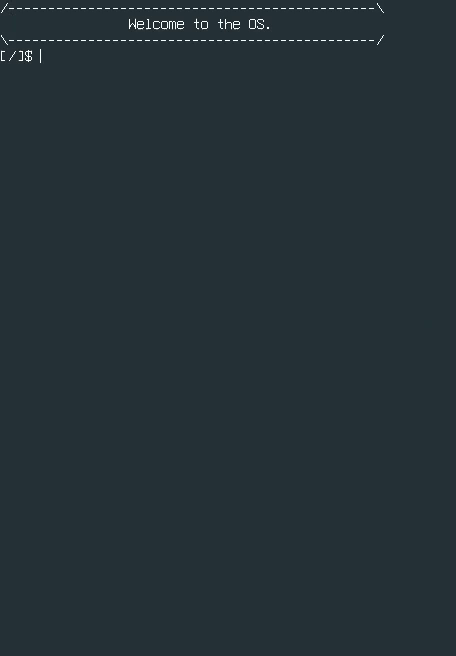

# Operating system from scratch.
My attempt to make a basic OS from scratch.
The goal of writing this OS is to get practical experience with C, get more knoledge about low level stuff.

# Do not test on real hardware!

# OS DEMO


## Main features:
* Custom bootloader
* 32 bit mode. Runs on Intel i386
* Devices: keyboard, CMOS RTS, timer, serial ports
* Video graphics: VBE 1920x1080 with a custom font
* Virtual memory(paging)
* Userspace programs(ELF loading)
* Small C library
* Multiprocessing support
* Virtual File System
* EXT2 file system

#Build
In order to build you need a cross-compiler(i387-elf-gcc, i386-elf-ld), NASM and qemu(qemu-system-i386)

To build an OS and disk - run:
```
make
make disk
```

To start the OS - run `make run`
